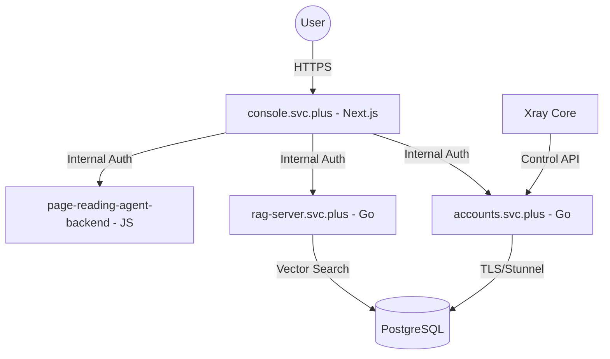

# Cloud Neutral Toolkit 项目全景概况 (Project Landscape Overview)

## 1. 运行环境 (Environments)

### 本地 / SIT 环境
| 维度 | 配置详情 |
| :--- | :--- |
| **基础域名** | `localhost`, `*.svc.plus` (通过 hosts 映射) |
| **核心服务** | Console (Port 3000), Accounts (Port 8080), RAG Server (Port 8081) |
| **数据库** | 本地 PostgreSQL, 通过 `stunnel` (Port 15432) 隧道连接远程或本地实例 |
| **认证方式** | 开发模式 Token (`INTERNAL_SERVICE_TOKEN`)，本地存储的会话 Cookie |
| **工具链** | Makefile 构建，Go 1.22+, Node.js 20+ |

### Online / Prod 环境
| 维度 | 配置详情 |
| :--- | :--- |
| **云平台** | Google Cloud Platform (GCP) |
| **计算引擎** | Google Cloud Run (Serverless 自动伸缩) |
| **托管区域** | `asia-northeast1` (Tokyo) |
| **数据存储** | Cloud SQL for PostgreSQL, pgvector 扩展 |
| **敏感信息** | GCP Secret Manager (管理数据库密码、OAuth Secrets、Service Tokens) |
| **部署模式** | 容器化部署 (Artifact Registry), GitHub Actions 触发 |

---

## 2. 部署、依赖与拓扑 (Architecture & Topology)

### 拓扑结构

### 核心依赖
- **服务治理**: `INTERNAL_SERVICE_TOKEN` 实现全链路服务信任。
- **配置同步**: Xray 节点通过定期同步任务与 `accounts.svc.plus` 的 Admin Settings 保持一致。
- **集成服务**: 支持 GitHub/Google OAuth2, Clerk (可选集成), SMTP (邮件验证)。

---

## 3. 域名系统 (Domains)

- **主仪表盘**: `https://console.svc.plus`
- **认证中心**: `https://accounts.svc.plus`
- **后台管理**: `https://console.svc.plus/panel/management`
- **RAG API**: `https://rag-server.svc.plus` (内部访问)

---

## 4. 核心 API 认证模式 (Authentication Models)

| 场景 | 模式 | 实现方式 |
| :--- | :--- | :--- |
| **用户访问 (Frontend)** | **Session/JWT** | OAuth2 登录后下发 `xc_session` Cookie 或 Bearer Token |
| **服务间通讯 (S2S)** | **Internal Token** | Header `X-Service-Token` 使用环内共享密钥验证 |
| **管理后台代理** | **Role-Based** | `Admin`/`Operator` 角色校验 + Session 验证 |
| **Agent 通讯** | **Agent Token** | Header `Authorization: Bearer <Token>` 对应 Agent 注册密钥 |

---

## 5. 交付与验证 (Delivery & Verification)

### 交付流程
1. **代码审查**: 遵循 Conventional Commits 规范。
2. **构建验证**: 执行 `make build` 确保多语言环境兼容性。
3. **集成测试**: 运行 `service-auth-integration-test.sh` 验证链路完整性。
4. **CI 部署**: 推送至主分支触发 Cloud Run 自动部署。

### 验证标准
- 关键 API 响应延时 < 200ms。
- OAuth 登录后自动与现有邮箱关联成功。
- 邮件黑名单在注册阶段能够正确拦截。

---

## 6. 测试报告汇总 (Test Reports)

### 功能测试
- ✅ **OAuth 绑定**: 支持 GitHub & Google 第三方邮箱验证自动绑定。
- ✅ **用户生命周期**: 实现暂停、恢复、注销及 Proxy UUID 动态续期。
- ✅ **黑名单控制**: 全量覆盖已知的垃圾邮件域名。

### 性能测试
- **全链路追踪**: 针对 RAG 检索链路进行优化，支持流式 (Streaming) 响应输出。
- **并发控制**: 后端连接池配置为 Max 20, Idle 10，满足高频并发鉴权请求。

---

## 7. 安全 (Security)

- **传输加密**: 全量 HTTPS 访问，内部 DB 连接强制 TLS 验证。
- **审计机制**: 集成 `security-audit` 技能，定期扫描硬编码 Secrets。
- **MFA 支持**: 内置 TOTP 多因子验证，支持手机二次确认。
- **数据残留**: `account.log` 等敏感日志已加入 `.gitignore` 并配置定期清理。

---

## 8. MCP/SKILL 关联 (MCP/SKILL Correlation)

| 关联项 | 技能/工具 (SKILL/MCP) | 作用说明 |
| :--- | :--- | :--- |
| **UI 开发** | `UI Design Standards` | 确保 Management 面板的权限矩阵、用户列表符合交互规范。 |
| **安全准入** | `Security Check (Observability)` | 在 `observability.svc.plus` 部署前进行 Gitleaks 静态扫描。 |
| **代码规范** | `git.conventional-commits` | 约束所有子项目的提交信息，便于生成变更日志 (Changelog)。 |
| **部署自动化** | `cloudrun` (MCP) | 直接操作 GCP 资源，查询服务状态与日志摘要。 |

---
**更新日期**: 2026-02-02
**维护者**: Cloud Neutral Toolkit 核心组
