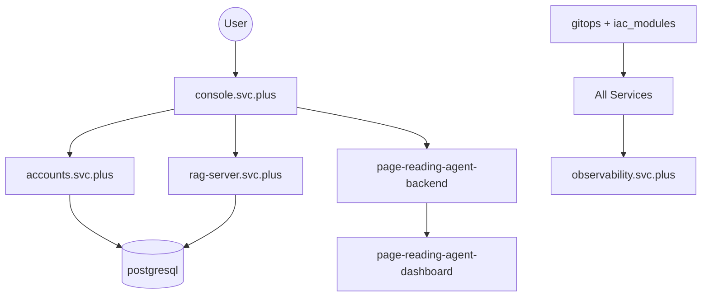

# Cloud-Neutral Toolkit Multi-Repo Control Plane

This repository is the control center for organizing and coordinating the Cloud-Neutral Toolkit multi-repo project.

## 1) Project Mission

- Keep architecture, ownership, standards, and release rhythm in one place.
- Drive cross-repo changes with consistent planning, testing, and rollback.
- Let Codex work from one workspace context to reduce path and dependency confusion.

## 2) Repository Registry

| Repo | Responsibility | Owner | Deploy Address | Local Path (Workspace) | Key Dependencies |
| --- | --- | --- | --- | --- | --- |
| `console.svc.plus` | Main frontend console (Next.js) | `@shenlan` | `https://console.svc.plus` | `Cloud-Neutral-Toolkit/console.svc.plus` | `accounts.svc.plus`, `rag-server.svc.plus`, `page-reading-agent-backend` |
| `accounts.svc.plus` | Identity/auth core (Go) | `@shenlan` | `https://accounts.svc.plus` | `Cloud-Neutral-Toolkit/accounts.svc.plus` | `postgresql.svc.plus` |
| `rag-server.svc.plus` | RAG backend (Go) | `@shenlan` | `https://rag-server.svc.plus` (internal) | `Cloud-Neutral-Toolkit/rag-server.svc.plus` | `postgresql.svc.plus`, vector data |
| `page-reading-agent-backend` | Reading/task backend service | `@shenlan` | `https://page-reading-agent-backend.svc.plus` | `cloud-neutral-toolkit/page-reading-agent-backend` | `accounts.svc.plus` |
| `page-reading-agent-dashboard` | Reading/task frontend dashboard | `@shenlan` | `https://page-reading-agent-dashboard.svc.plus` | `cloud-neutral-toolkit/page-reading-agent-dashboard` | `page-reading-agent-backend` |
| `postgresql.svc.plus` | PostgreSQL runtime and bootstrap | `@shenlan` | Internal DB endpoint | `Cloud-Neutral-Toolkit/postgresql.svc.plus` | Infra, secrets |
| `moltbot.svc.plus` | Bot/service integration runtime | `@shenlan` | `https://moltbot.svc.plus` | `Cloud-Neutral-Toolkit/moltbot.svc.plus` | `accounts.svc.plus` |
| `agent.svc.plus` | Agent runtime and orchestration | `@shenlan` | `https://agent.svc.plus` | `Cloud-Neutral-Toolkit/agent.svc.plus` | `accounts.svc.plus`, task services |
| `observability.svc.plus` | Logs/metrics/tracing stack | `@shenlan` | `https://observability.svc.plus` | `cloud-neutral-toolkit/observability.svc.plus` | All services |
| `gitops` + `iac_modules` | Deployment/IaC and environment definitions | `@shenlan` | N/A | `cloud-neutral-toolkit/gitops`, `cloud-neutral-toolkit/iac_modules` | Cloud provider APIs |

## 3) Architecture

## 4) Control Documents

- Unified agent operating rules: `AGENTS.md`
- Unified standards (branch/PR/commit/version/release): `docs/operations-governance/governance.md`
- Release checklist (ordered by repo): `docs/operations-governance/release-checklist.md`
- Cross-repo task board and templates: `docs/operations-governance/cross-repo-tasks.md`
- Workspace aggregation: `console.svc.plus.code-workspace`

## 5) Codex Operating Model (Cross-Repo Change)

For every cross-repo request, Codex must return this structure:

1. **Change Scope** (repos + reason)
2. **Files Changed** (per repo)
3. **Risk Points** (behavior/security/compatibility)
4. **Test Commands** (unit/integration/smoke)
5. **Rollback Plan** (revert order + data safety)

## 6) Suggested Task Intake

Use one objective per request, for example:

- "Add `X-Service-Token` validation to console/accounts/rag"
- "Upgrade Next.js major version across frontend repos"
- "Align CI cache strategy for all Node repos"

---
Last updated: 2026-02-03
