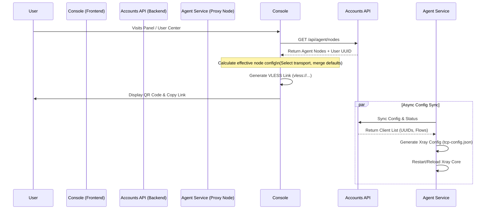

# VLESS QR Code Generation Flow

This document details the end-to-end architecture and data flow for generating VLESS connection QR codes in the Console.

## Overview

The VLESS QR code feature allows users to easily connect their clients to the proxy service. The generation process involves dynamic data flow from the backend (Accounts Service) to the frontend (Console), ensuring that the displayed connection details (UUID, Flow, Transport) match the actual server configuration.

## Architecture

## Component Details

### 1. Frontend: Console (`console.svc.plus`)

*   **Component**: `VlessQrCard` (`src/modules/extensions/builtin/user-center/components/VlessQrCard.tsx`)
*   **Logic**: `vless.ts` (`src/modules/extensions/builtin/user-center/lib/vless.ts`)
*   **Responsibility**:
    *   Fetches node list from `/api/agent/nodes`.
    *   Constructs the **Effective Node** configuration based on user selection (TCP vs XHTTP).
    *   **Crucial**: Uses the `flow` property returned by the API (e.g., `xtls-rprx-vision` for TCP) to ensure the client configuration matches the server's requirement.
    *   Generates standard `vless://` URI scheme.

### 2. Backend: Accounts Service (`accounts.svc.plus`)

*   **Role**: **The Central Bridge**
    *   Acts as the authoritative intermediary between the User (Console) and the Infrastructure (Agent).
    *   Ensures that the configuration displayed to the user creates a valid connection to the server.

*   **Key Responsibilities**:
    1.  **Authentication & Authorization**:
        *   Validates the user's session from the Console.
        *   Validates the Agent's identity via `INTERNAL_SERVICE_TOKEN` and `AuthUrl`.
        *   Ensures only authorized users can access node information and only authorized agents can sync configuration.
    2.  **Configuration Aggregation (The "Bridge" Logic)**:
        *   **Dynamic Data**: Retrieving user-specific secrets (UUID) from the database.
        *   **Static Templates**: Merging user data with server-side templates (e.g., `template_tcp.json`) which define protocol details like `flow`, `port`, and `transport`.
        *   **API Response**: Delivers a unified JSON object to the Console containing both the Node's public address and the User's specific parameters.
    3.  **State Management**:
        *   Maintains the "Source of Truth" for active nodes.
        *   If a node changes its configuration (e.g., updates `flow` requirement), the Accounts Service updates the template, and both Console (on next refresh) and Agent (on next sync) receive the new state, keeping them in lockstep.

*   **API**: `/api/agent/nodes` (`api/user_agents.go`)
    *   **Injects User Identity**: returns the current user's UUID as part of the node/user data.
    *   **Defines Node Properies**: Sets default transport, port (`1443`), and flow (`xtls-rprx-vision`).

### 3. Agent: Agent Service (`agent.svc.plus`)

*   **Component**: `xrayconfig.Generator` (`internal/xrayconfig/generator.go`)
*   **Responsibility**:
    *   Periodically pulls configuration from Accounts Service.
    *   **Template Rendering**: Uses Go text templates (`template_tcp.json`) to generate the actual Xray JSON config.
    *   **Variable Substitution**: Replaces `{{.Domain}}` and `{{ UUID }}` with actual values, ensuring the server listens for the exact UUIDs that the frontend is distributing.

## Data Flow & Key Fields

| Field | Source | Flow | Destination |
| :--- | :--- | :--- | :--- |
| **UUID** | Auth Database | `Accounts API` -> `Console` | `vless://...` (User ID) |
| **UUID** | Auth Database | `Accounts API` -> `Agent` | `config.json` (Server Client ID) |
| **Flow** | `template_tcp.json` | `Accounts API` -> `Console` | `vless://...&flow=xtls-rprx-vision` |
| **Domain**| Env / Config | `Agent` -> `Generator` | `config.json` (Cert Path, SNI) |

## Troubleshooting

If the QR code does not work:

1.  **Check Link Parameters**: Decode the QR code or copy the link.
    *   Does it have `flow=xtls-rprx-vision` for TCP?
    *   Is the UUID correct?
2.  **Verify Agent Logs**:
    *   `ssh root@<node-domain>`
    *   `journalctl -fu agent-svc-plus`
    *   Look for "xray config synchronized".
3.  **Check Server Config**:
    *   `cat /usr/local/etc/xray/tcp-config.json`
    *   Ensure the UUID is present in the `clients` list.
