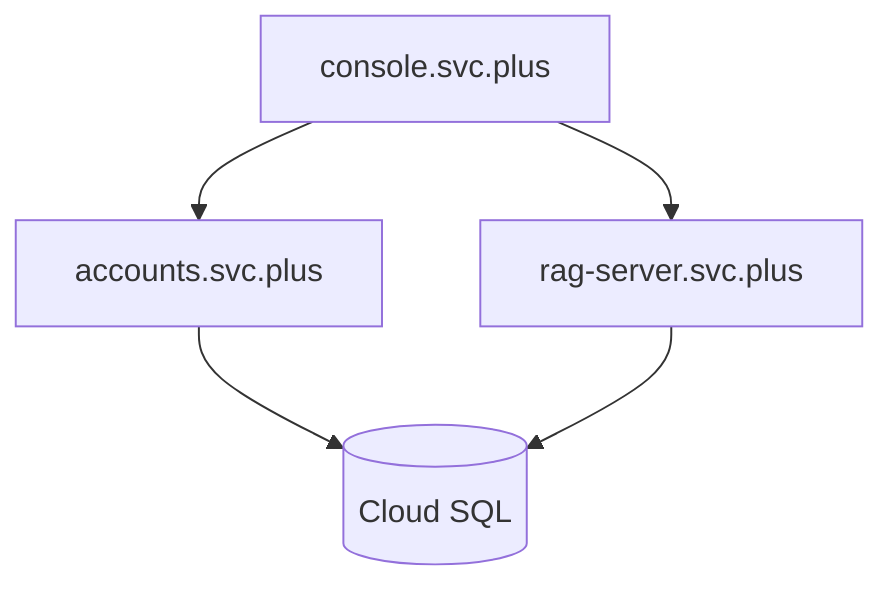

# Project Management Skill

This skill documents the standard management procedures and project architecture for the Cloud Neutral Toolkit ecosystem.

## 1. Environment & Infrastructure

### Local / SIT Environment
- **Registry**: Local builds using `Makefile`.
- **Database**: PostgreSQL accessible via `stunnel` on `localhost:15432`.
- **Secrets**: Managed via local `.env` and `.env.local` files (git-ignored).

### Production (GCP + Vercel)
- **Backend Deployment**: Google Cloud Run (asia-northeast1).
- **Frontend Deployment**: [Vercel svc-designs-projects](https://vercel.com/svc-designs-projects).
- **Domain**: `*.svc.plus`.
- **Secrets**: Google Secret Manager / Vercel Environment Variables.

## 2. Authentication Models

### Service-to-Service (S2S)
All internal requests between `console`, `accounts`, `rag-server`, and `page-reading-agent` must include:
- Header: `X-Service-Token: <INTERNAL_SERVICE_TOKEN>`

### User-to-Service
- **Public**: OAuth2 (GitHub/Google) with mandatory email verification.
- **Session**: `xc_session` cookie for shared subdomain authentication.
- **Admin**: Role-based access control (RBAC) enforced on `/api/admin/*` endpoints.

## 3. Deployment Topology

## 4. Delivery & Verification Checklist

- [ ] **Standardization**: Use `Makefile` for all build/test/run operations.
- [ ] **Auth**: New endpoints must be wrapped in `AuthMiddleware` and `InternalAuthMiddleware`.
- [ ] **Validation**: Cross-service authentication tests must pass before production deployment.
- [ ] **Security**: No secrets in source code; use GCP Secret Manager in prod.

## 5. Related Skills

- **[Security Audit](../security-audit/SKILL.md)**: Detects vulnerabilities and hardcoded secrets.
- **[Git Standards](../git.conventional-commits.v1.md)**: Ensures clean commit history.
- **[Agent Controller API Compat](../agent-controller-api-compat/SKILL.md)**: Prevents API path drift incidents between agent and controller.

## 6. Project References

## 7. Continuous Validation

- **Status Check**: Always consult `docs/architecture/project-overview.md` Section 9 before starting new features to avoid conflicts with known production/SIT discrepancies.
- **Error Pattern Recognition**: If 404/502/503 errors appear in the Management Panel, verify if the backend routes (e.g., `/api/admin` vs `/api/auth/admin`) match the frontend expectations in the documentation.
- **Multi-Cloud Sync**: Remember that Vercel (Frontend) and Cloud Run (Backend) require synchronized deployments to avoid RSC data mismatches.
